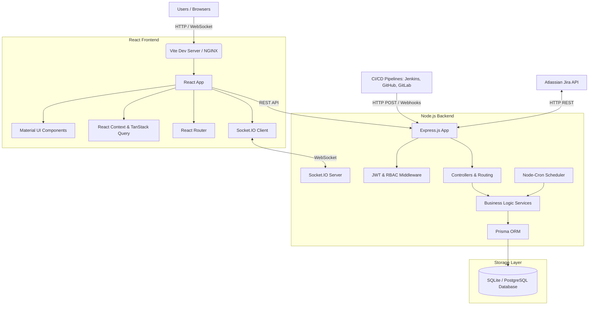

# Architecture Diagram

The QA Analytics Dashboard uses a standard modern multi-tier web application architecture.

## Component Breakdown

1. **Client Tier**: A React 19 application utilizing Material UI for styling, Recharts for data visualization, and TanStack Query (React Query) for API caching. 
2. **Application Tier**: A Node.js / Express backend providing RESTful APIs. It manages business logic, automated background scheduling (`node-cron`), and integrates directly with external services like Ethereal Email (SMTP) and Jira.
3. **Data Tier**: Prisma ORM maps Node.js objects to the SQL Database (SQLite for local dev, PostgreSQL for production), ensuring type safety and enforcing referential integrity.
4. **Real-time Pipeline**: Socket.IO enables a bidirectional event pipeline between the Application Tier and the Client Tier, driving live, frictionless dashboard updates.
