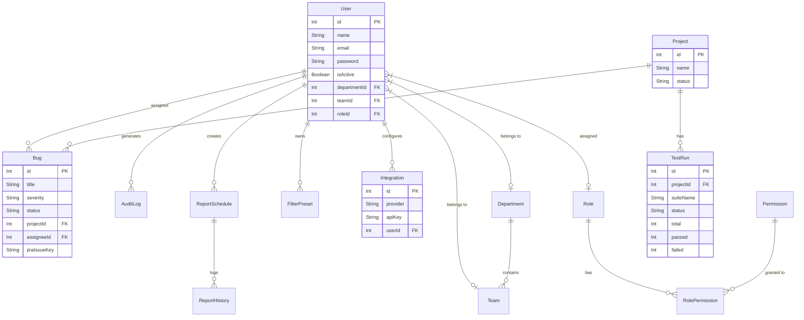

# Entity-Relationship (ER) Diagram

The QA Analytics Dashboard database model is managed via Prisma ORM. Below is the structural representation of the core data entities and their relationships.

## Key Modules

- **RBAC (Role-Based Access Control)**: `User`, `Role`, `Permission`, `RolePermission`. Maps complex hierarchical enterprise roles down to granular action/resource constraints.
- **Tracking Core**: `Project`, `TestRun`, `Bug`. The central nexus of analytics containing all testing execution statistics and defect details.
- **Reporting**: `ReportSchedule`, `ReportHistory`. Manages automated cron-based background jobs for PDF/Excel distributions.
